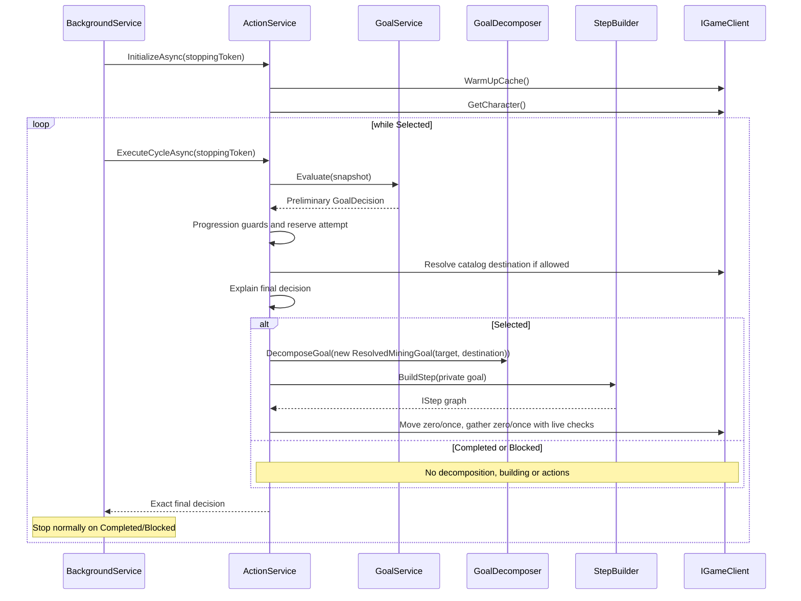

# Architecture

## System context

Artiact is an ASP.NET Core application that hosts operational HTTP endpoints and a staged worker (Inspect by default), with an explicit legacy autonomous mode. Its outward dependency is the Artifacts MMO-compatible HTTP API. For local development, `Artiact.MockService` implements only a subset of that API.

```mermaid
flowchart LR
    Host[ASP.NET Core host] --> Mode{Execution mode}
    Mode --> Staged[StagedWorker: Inspect or OneShot]
    Staged --> Portfolio[StrategySession]
    Portfolio --> Client
    Mode --> Worker[Explicit legacy ArtiactBackgroundService]
    Worker --> Action[ActionService]
    Action --> Goal[GoalService]
    Action --> Decomposer[GoalDecomposer]
    Action --> Builder[StepBuilder]
    Builder --> Steps[IStep graph]
    Steps --> Client[IGameClient / GameClient]
    Client --> HTTP[IGameHttpClient]
    HTTP --> API[Artifacts API or MockService]
    Client --> Cache[JSON reference-data cache]
    Host --> Health[/health]
    Host --> Metrics[/metrics]
    Host --> Telemetry[Console + OTLP + Prometheus]
```

## Project boundaries

### `Artiact`

Executable host and application logic:

- `Program.cs` configures settings, logging, OpenTelemetry, DI, the hosted worker, `/health` and Prometheus scraping.
- `Services/` owns goal selection/decomposition, craft planning, map lookup, character state and action orchestration.
- `Resolvers/` contains the mob-drop resolver but uses the `Artiact.Services` namespace.
- `Models/Steps/` contains executable command objects.
- `Client/` owns authentication, API calls, retries, pagination and local reference-data caching.

### `Artiact.Contracts`

Shared boundary types used by the main app, tests and mock service: `IGameClient`, API DTOs, goals, `CraftTarget`, `CraftStep`, `LootPrerequisite` and map/resource value types. Changes here can affect every project.

### `Artiact.MockService`

Standalone ASP.NET Core service for deterministic local character, movement and gathering behavior for basic-mining and mining-progression. It is not a complete server emulator and is not currently a reverse proxy despite its `Artiact.SmartProxy` root namespace.

### `Artiact.Tests`

Unit and flow-oriented tests using xUnit and Moq. Tests focus on craft-chain construction, target selection, looting resolution and step execution.

## Startup and lifetime

`Program.Main` performs these steps:

1. Builds configuration from output-directory `appsettings.json`, optional environment-specific JSON, user secrets, environment variables and CLI (last wins).
2. Registers logging, `HttpClient`, settings and OpenTelemetry.
3. Registers application services as scoped; `ActivitySource` is singleton. `AddGoalSelection` binds and validates the positive mining target on startup before worker initialization.
4. Registers StagedWorker by default; explicit validated Legacy mode registers ArtiactBackgroundService.
5. Maps metrics, liveness and freshness-sensitive readiness, then starts the web host.

In explicit Legacy mode, `ArtiactBackgroundService.ExecuteAsync` creates one dependency-injection scope for its lifetime. It calls `IActionService.InitializeAsync(stoppingToken)` once, then calls `ExecuteCycleAsync(stoppingToken)` serially while decisions are Selected. Each call reads one planning snapshot, evaluates the pure selector and finalizes Selected through run guards and catalog resolution. It explains and returns the exact final immutable decision. Selected constructs a private ResolvedMiningGoal and executes one MiningStep; final Completed/Blocked performs no execution and terminates the worker normally without recovery delay. Mining invokes Move zero/one times and Gathering zero/one times; a later cycle reselects resources. AddMiningProgression binds validated limits and registers the scoped run state shared by ActionService/StepBuilder plus the production cooldown wait. A cycle failure is logged and followed by a cancellable 30-second recovery delay. Shutdown cancellation exits normally; other initialization failures are critical and terminate the hosted service.

> Default Inspect performs read-only planning. Explicit OneShot/Legacy modes can act; see [staged operation](staged-operation.md).

## Retained legacy action pipeline



The selector fails closed before decomposition when below-target inventory is invalid or has fewer than ten free units. Existing independently supplied goal decomposition/crafting remains available; it is not an autonomous inventory-remediation fallback. Before actions and after movement, MiningStep checks target, inventory, valid XP and resource eligibility. Changed level or wrong movement destination suppresses gathering. Responses are saved and gather progress is accounted before cancellation; the next cycle reports terminal effects.

## Step execution model

- `MixedStep` executes child steps sequentially.
- `ConditionalStep` evaluates live character state and may skip its child.
- `MoveStep` moves to a map point for generic/craft paths.
- MiningStep owns one resolved destination and bounded move/gather execution, using the injected IMiningCooldownDelay for returned total seconds.
- `GatheringStep` and generic `ActionStep` call `IGameClient` actions.
- `ActionStep` saves the returned character and delays for the API cooldown. It can repeat while a predicate remains true and may enforce a maximum attempt count.

Subgoals are built before their parent goal, so prerequisite craft or inventory work executes first.

## API client and cache

`GameHttpClient` obtains a token from `/token` using Basic authentication, then uses the returned Bearer token. `GameClient` exposes character actions and paginated map/resource/item/monster reads.

Action calls dispatch once. Network/timeout/read/JSON failures and HTTP 5xx produce sanitized `ActionFailureException(UnknownOutcome)`; other unsuccessful responses produce `Rejected` with the status code. Both stop the worker without recovery repetition. Token rejection prevents action dispatch. Concrete operation scopes propagate cancellation through reads/authentication; GET has a shared two-send budget and bounded token refresh. POST never retries. Fight adapts exactly one ordinal-name participant from `data.characters` into `Data.Character` and retains `data.fight`; named equipment requests use one-element arrays. The explicit CombatSessionFactory provides a bounded fire-only deterministic combat path with presence-aware observations and current map identities; see [combat progression](combat-progression.md). Default startup inspects the explicit portfolio.

CacheService stores atomic versioned envelopes in OS local application data, partitioned by endpoint/version. Default TTL is 48 hours; malformed, future and mismatched entries miss. Tracked snapshots are untouched.

## Observability

- Console and NLog logging.
- `ActionService` alone emits one Information `GoalDecision` event per evaluated cycle and matching activity tags: `goal.decision.status`, `goal.decision.reason`, `goal.mining.target_level`; observed current level adds `goal.mining.current_level`. Valid inventory facts add `goal.inventory.capacity`, `.used`, `.free`, `.required_free` (each with the `goal.inventory` prefix). Completed/invalid snapshots omit inventory fields; absent characters omit current level. No character/account/inventory contents enter the decision event. Worker logs do not duplicate it; tracing listeners are optional.
- Final Selected adds resource code/level and destination X/Y. Selected and progression-only Blocked add attempted_cycles, max_cycles, consecutive_no_progress and max_no_progress under goal.mining. Other terminal decisions omit these fields. Failed catalog loading emits no fabricated decision; it retains the attempt and propagates through existing error recovery.
- W3C activity IDs and `ActivitySource("Artiact.Client")`.
- ASP.NET Core and `HttpClient` tracing.
- Console and OTLP HTTP/protobuf trace exporters; Telemetry:Endpoint replaces ZipkinSettings.
- `Meter("Artiact.Application")` and Prometheus exporter.
- `/health/live` reports process liveness; `/health` and `/health/ready` expose staged state and freshness-sensitive readiness without calling the API.

`docker-compose.yml` starts Prometheus on 9090, Grafana on 3000 and Zipkin on 9411. Artiact itself runs outside Compose. The committed Prometheus target `localhost:5000` resolves inside the Prometheus container and does not reach a host-run Artiact process as configured.

## Explicit strategy sessions

StrategySessionFactory registers the portfolio described in [Strategy portfolio](strategy-portfolio.md). Observation, deterministic candidate strategies and the serialized one-command coordinator are separate from the legacy ActionService worker. Each tick performs fresh preflight; unknown outcomes require read-only reconciliation. Compatibility paths remain until parity.
