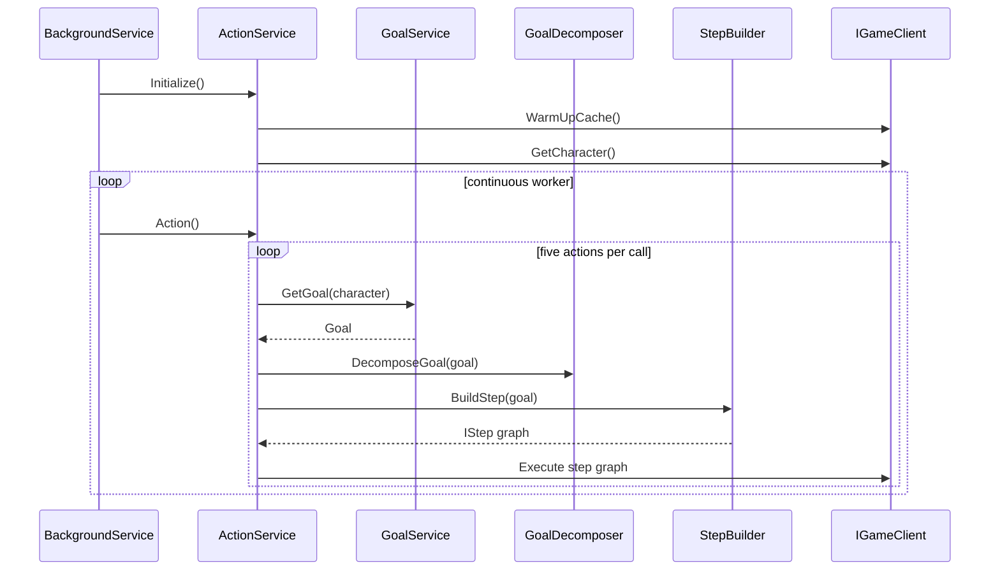

# Architecture

## System context

Artiact is an ASP.NET Core application that hosts both operational HTTP endpoints and an autonomous `BackgroundService`. Its outward dependency is the Artifacts MMO-compatible HTTP API. For local development, `Artiact.MockService` implements only a subset of that API.

```mermaid
flowchart LR
    Host[ASP.NET Core host] --> Worker[ArtiactBackgroundService]
    Worker --> Action[ActionService]
    Action --> Goal[GoalService]
    Action --> Decomposer[GoalDecomposer]
    Action --> Builder[StepBuilder]
    Builder --> Steps[IStep graph]
    Steps --> Client[IGameClient / GameClient]
    Client --> HTTP[IGameHttpClient]
    HTTP --> API[Artifacts API or MockService]
    Client --> Cache[JSON reference-data cache]
    Host --> Health[/health]
    Host --> Metrics[/metrics]
    Host --> Telemetry[Console + Zipkin + Prometheus]
```

## Project boundaries

### `Artiact`

Executable host and application logic:

- `Program.cs` configures settings, logging, OpenTelemetry, DI, the hosted worker, `/health` and Prometheus scraping.
- `Services/` owns goal selection/decomposition, craft planning, map lookup, character state and action orchestration.
- `Resolvers/` contains the mob-drop resolver but uses the `Artiact.Services` namespace.
- `Models/Steps/` contains executable command objects.
- `Client/` owns authentication, API calls, retries, pagination and local reference-data caching.

### `Artiact.Contracts`

Shared boundary types used by the main app, tests and mock service: `IGameClient`, API DTOs, goals, `CraftTarget`, `CraftStep`, `LootPrerequisite` and map/resource value types. Changes here can affect every project.

### `Artiact.MockService`

Standalone ASP.NET Core service for deterministic local character, movement, gathering and crafting behavior. It is not a complete server emulator and is not currently a reverse proxy despite its `Artiact.SmartProxy` root namespace.

### `Artiact.Tests`

Unit and flow-oriented tests using xUnit and Moq. Tests focus on craft-chain construction, target selection, looting resolution and step execution.

## Startup and lifetime

`Program.Main` performs these steps:

1. Builds configuration from output-directory `appsettings.json`, optional environment-specific JSON and user secrets.
2. Registers logging, `HttpClient`, settings and OpenTelemetry.
3. Registers application services as scoped; `ActivitySource` is singleton.
4. Registers `ArtiactBackgroundService`.
5. Maps `/metrics` and `/health`, then starts the web host.

`ArtiactBackgroundService.ExecuteAsync` creates one dependency-injection scope for its lifetime. It calls `IActionService.Initialize()`, then continuously calls `Action()` until cancellation. An exception from one action batch is logged and delayed for 30 seconds before retry. Initialization failures are critical and terminate the hosted service.

> Running the main application is a side effect: the worker begins issuing game actions immediately after initialization.

## Action pipeline



The current goal provider always returns `GatheringGoal(20)`. Decomposition adds `SpendResourcesGoal` when fewer than ten inventory units remain available. Craftable inventory resources may become `GearCraftingGoal` subgoals.

## Step execution model

- `MixedStep` executes child steps sequentially.
- `ConditionalStep` evaluates live character state and may skip its child.
- `MoveStep` moves to a map point.
- `GatheringStep` and generic `ActionStep` call `IGameClient` actions.
- `ActionStep` saves the returned character and delays for the API cooldown. It can repeat while a predicate remains true and may enforce a maximum attempt count.

Subgoals are built before their parent goal, so prerequisite craft or inventory work executes first.

## API client and cache

`GameHttpClient` obtains a token from `/token` using Basic authentication, then uses the returned Bearer token. `GameClient` exposes character actions and paginated map/resource/item/monster reads.

Action calls retry up to three times with a one-second delay for `HttpRequestException`, `TaskCanceledException`, HTTP 502 and HTTP 504. Other unsuccessful responses fail immediately. Reference-data GETs do not use this retry path. Retries do not receive a cancellation token from the hosted worker, and expired Bearer tokens are not refreshed after a 401.

`CacheService` stores one JSON file per reference-data element type under a relative `cache` directory and treats it as fresh for 48 hours. The cache path therefore depends on the process working directory.

## Observability

- Console and NLog logging.
- W3C activity IDs and `ActivitySource("Artiact.Client")`.
- ASP.NET Core and `HttpClient` tracing.
- Console and Zipkin trace exporters.
- `Meter("Artiact.Application")` and Prometheus exporter.
- `/health` returns a static healthy response and UTC timestamp; it does not probe the game API, cache, worker state or Zipkin.

`docker-compose.yml` starts Prometheus on 9090, Grafana on 3000 and Zipkin on 9411. Artiact itself runs outside Compose. The committed Prometheus target `localhost:5000` resolves inside the Prometheus container and does not reach a host-run Artiact process as configured.
