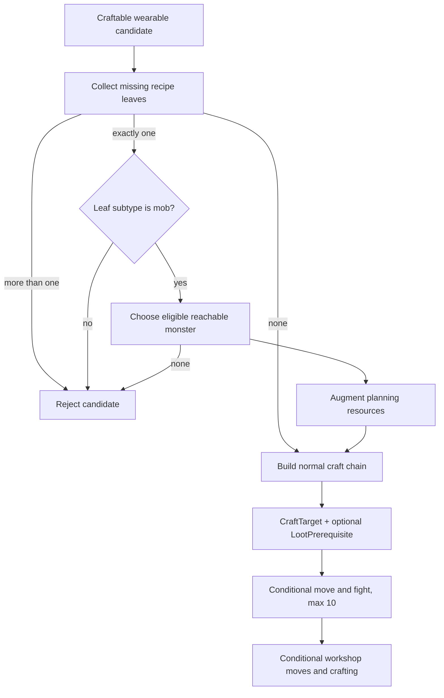

# Domain model

## Core language

| Term | Meaning in current code | Primary types |
|---|---|---|
| Character | Mutable snapshot of the configured game character, including position, levels and inventory | `Character`, `CharacterService` |
| Goal | Desired activity represented as a tree; subgoals execute before their parent | `Goal`, `GatheringGoal`, `SpendResourcesGoal`, `GearCraftingGoal` |
| Step | Executable operation or composition built from a goal | `IStep`, `MixedStep`, `ConditionalStep`, `ActionStep`, `MoveStep` |
| Craft target | One final wearable item plus an ordered craft chain and optional loot prerequisite | `CraftTarget` |
| Craft step | One recipe execution in the chain, with required inputs and quantity | `CraftStep` |
| Loot prerequisite | A single mob-dropped item quantity that must exist before crafting, together with its monster and map location | `LootPrerequisite` |
| Reference data | Maps, resources, items and monsters fetched from the API and cached as JSON | `GameClient`, `CacheService` |

These definitions describe the current implementation. There is no repository-level product glossary or formal bounded-context map.

## Goal tree

`Goal` owns `SubGoals` and sets `ParentGoal` through `AddSubGoal`. `GoalDecomposer` currently handles:

- `GatheringGoal`: independently supplied goals retain the legacy inventory-spending decomposition. Autonomous selection blocks insufficient inventory before reaching this path. Gathering execution checks mining below its target and valid free inventory of at least ten before the first gather and every repeat.
- `SpendResourcesGoal`: find wearable craft targets from resources marked `Craft`, then add one `GearCraftingGoal` per target.
- `GearCraftingGoal`: already contains a planned `CraftTarget`; execution is built by `StepBuilder`.

`LevelUpGoal` exists as a contract type but is not handled by `GoalDecomposer` or `StepBuilder`. `SpendMethod.Recycle` is also not implemented in step building.

## Explainable mining selection

`GoalService.Evaluate(Character?)` makes a pure deterministic decision using one snapshot and a configured target. The application-owned immutable `GoalDecision` has validated factories, no public constructor/setters and no mutable goal. It records status, typed reason, stable reason code, target, nullable current mining level, nullable capacity/used/free as a group, required free inventory `10`, and nullable `SelectedGoalType`. Only Selected contains `GoalType.Gathering`; ActionService creates a fresh execution goal after selection.

Evaluation precedence is fixed:

1. Target <= 0: Blocked / `invalid_goal_policy`, no observed level or inventory facts.
2. Missing character or negative mining: Blocked / `invalid_character_snapshot`, nullable or observed negative level, no inventory facts.
3. Mining >= target: Completed / `mining_target_reached`, no inventory access or inventory facts.
4. Invalid inventory: Blocked / `invalid_inventory_snapshot`, no inventory facts.
5. Free capacity < 10: Blocked / `inventory_pressure`, exact inventory facts.
6. Otherwise: Selected / `mining_below_target`, exact inventory facts and gathering type.

The shared selection/live inventory rule rejects null lists/elements, negative capacity/quantity, positive quantity with blank/null item code, checked integer sum overflow, and used capacity greater than capacity. Zero-quantity slots contribute zero regardless of code. At target 20, mining 19 with capacity 20 and used 10 selects; used 11 blocks. Mining 20 or 21 completes even with malformed inventory.

`ConditionalStep` applies the live predicate after any move and before the first gather; the ActionStep repeat predicate applies it after each saved response. Negative mining or invalid inventory returns false without authorizing another gather. Reaching target or falling from ten to nine free units stops repeats. The authoritative response remains stored, the selected cycle returns normally, and one next cycle emits Completed/Blocked before the worker stops. Blocked requires intervention/restart; no crafting, deletion, banking or other remediation is selected.

## Craft planning

`WearCraftTargetFinder` loads all items, considers craftable wearable types, builds candidate chains through `CraftChainBuilder`, asks `CraftTargetEvaluator` to select a target, and subtracts the consumed real inventory before planning another target.

Wearable types are currently hard-coded: `weapon`, `boots`, `helmet`, `body_armor`, `leg_armor`, `ring`, `amulet`, and `shield`.

`CraftChainBuilder` recursively expands recipes, rejects repeated dependencies through a request-wide visited set, puts prerequisite crafts before their consumers, and fails when a leaf ingredient is unavailable. The set is not unwound after a branch, so a shared dependency may be rejected as if it were a cycle. `CraftTargetEvaluator` currently chooses by item level; character state is supplied to the interface but is not used by that implementation.

## Looting-aware crafting

The branch implements this bounded scenario:

1. `WearCraftTargetFinder` recursively determines missing leaf ingredients for a candidate recipe.
2. A candidate is eligible for looting only when exactly one distinct leaf item is missing. Two different missing mob drops fail closed.
3. `TargetLootingResolver` accepts only items whose subtype is `mob`.
4. It filters monsters to `monster.Level <= character.Level + 1` and monsters that drop the item.
5. Candidates are ordered by descending drop rate; the first candidate with a map point is selected.
6. The finder augments a planning-only resource copy with the required absolute inventory quantity and builds the normal craft chain.
7. The resulting `CraftTarget` carries a `LootPrerequisite`; real inventory accounting remains separate so planning cannot create free reusable resources.
8. `StepBuilder` conditionally moves to the monster and calls `Fight()` until live inventory reaches `RequiredQuantity`.
9. Loot acquisition stops after ten fight attempts and throws if the quantity is still insufficient.
10. Craft steps then conditionally move to each required workshop and execute in order.

### Important invariants

- `RequiredQuantity` is the absolute inventory quantity needed before crafting, not simply the missing delta.
- Only the planning copy receives the synthetic loot quantity.
- Selection may continue only while a target consumes at least one real inventory resource; this prevents a zero-consumption planning loop.
- Execution predicates read live `CharacterService` state, so loot acquired or consumed after planning is handled at execution time.
- The implementation chooses one monster source and does not model probabilistic expected fight counts, combat stats, healing or death recovery.

## State ownership

`CharacterService` stores the latest character snapshot in memory. Every successful `ActionStep` replaces it with the character returned by the API. Planning reads that snapshot; it does not own server state.

The main app's source of truth for actions is the external API response. The mock service has a separate singleton in-memory character cache and should not be confused with `CharacterService`.

## Change impact guide

- Goal semantics: update contracts, `GoalDecomposer`, `StepBuilder` and tests together.
- New game action: update `IGameClient`, `GameClient`, step construction and any mock/test doubles.
- Craft model changes: inspect `CraftTarget`, `CraftStep`, finder, chain builder, evaluator, step builder and Moq setups.
- Loot policy changes: add resolver and end-to-end planning/execution tests; do not rely only on resolver tests.
